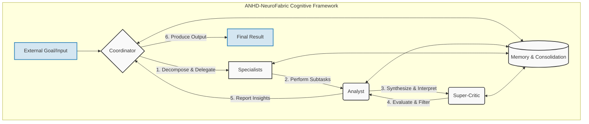

# The ANHD-NeuroFabric Cognitive Framework: A Modular Synthetic Brain Architecture

**Author:** Nguyen Hieu Duc An (Andy H. Nguyen)  
_Independent AI systems researcher exploring modular synthetic cognition and emergent intelligence frameworks._  
**License:** Creative Commons Attribution – NonCommercial 4.0 International (CC BY-NC 4.0)  
**Version:** 1.0

---

## Conceptual Figure

This diagram illustrates the flow of information and control within the NeuroFabric framework. The Coordinator decomposes a goal, Specialists execute tasks, the Analyst synthesizes results, the Super-Critic ensures quality, and the Memory region enables learning and adaptation across the entire system.



---

## 1. Overview

**ANHD-NeuroFabric** reimagines artificial cognition not as a single massive model but as a **living cognitive network** of cooperating, specialized AI agents — _cells_ — that interact like neurons in a brain.  
Each agent specializes in a narrow skill or process, but together, through structured communication and self-organizing feedback, they exhibit emergent intelligence.

Modern AI scales primarily by adding parameters and extending context windows.  
NeuroFabric proposes a more **organic and efficient approach**: scaling through modularity, cooperation, and adaptive orchestration.  
It’s a brain, not a boulder — flexible, distributed, and alive with communication.

---

## 2. Origins and Vision

The framework draws inspiration from three converging disciplines:

- **Neuroscience:** The human brain functions as a network of semi-autonomous regions — visual, auditory, prefrontal — each specialized but deeply interconnected.
- **Cognitive Science:** Marvin Minsky’s _Society of Mind_ (1986) described intelligence as emerging from the collaboration of many simple agents.
- **Multi-Agent Systems:** The FIPA standards (Foundation for Intelligent Physical Agents) established message-driven autonomy between computational agents.  
  [FIPA ACL Message Structure Specification](./docs/FIPA ACL Message Structure Specification.pdf)

The central idea is that cognition isn’t about size; it’s about **structure**.  
The goal of ANHD-NeuroFabric is to engineer _emergent intelligence through communication topology_, not raw parameter count.

---

## 3. The Architecture: Brain Regions as Agent Networks

NeuroFabric organizes cognition into five core regions, mirroring the modular architecture of the human brain.

| Region                     | Primary Role                                                                        | Biological Analogy                 |
| -------------------------- | ----------------------------------------------------------------------------------- | ---------------------------------- |
| **Coordinator**            | Global controller that decomposes goals, delegates subtasks, and monitors progress. | Prefrontal Cortex                  |
| **Analyst**                | Interprets context, synthesizes findings, and manages feedback to the Coordinator.  | Parietal Cortex                    |
| **Specialists**            | Perform concrete subtasks (e.g., reasoning, coding, retrieval, perception).         | Cortical Modules                   |
| **Super-Critic**           | Evaluates and filters outputs, detects inefficiencies, and enforces quality.        | Basal Ganglia / Anterior Cingulate |
| **Memory & Consolidation** | Stores experiences, reinforces successful pathways, and prunes failing ones.        | Hippocampus → Cortex               |

Each region is composed of multiple agents — or “cells” — operating asynchronously.  
The intelligence of the whole system emerges from the coordination of these parts.

---

## 4. Communication: The Language of the Fabric

### 4.1. Hybrid Message Protocol

Agents communicate using a **hybrid protocol** with three layers:

1. **Control Layer** — Modeled on FIPA performatives: `REQUEST`, `INFORM`, `PROPOSE`, `CONFIRM`, `EVALUATE`.  
   Reference: https://web.archive.org/web/20180820183844/http://www.fipa.org/specs/fipa00061/SC00061G.pdf
2. **Semantic Layer** — Messages embed high-dimensional vector representations of content (e.g., CLIP embeddings).  
   Radford et al., _Learning Transferable Visual Models from Natural Language Supervision_ (2021).  
   https://arxiv.org/abs/2103.00020
3. **Summary Layer** — Each message includes a concise natural-language report for interpretability and debugging.

### 4.2. Example Message

```json
{
  "performative": "PROPOSE",
  "from": "specialist_math",
  "to": "analyst",
  "intent": "subtask_result",
  "content": "Computed optimal parameters, confidence=0.87",
  "embedding_id": "vec_9482"
}
```

Agents publish and subscribe to semantic channels via asynchronous messaging middleware (for example, MQTT – https://mqtt.org/).  
This system behaves like a neural bus — decoupled, parallel, and resilient.

---

## 5. Adaptive Scaling and Efficiency

### 5.1. Scaling Through Coordination, Not Size

Most AI systems scale by inflating a single model’s size.  
NeuroFabric scales by **recruiting more agents** and coordinating them efficiently.  
Each agent advertises a _capability vector_ describing its skills, latency, and compute cost.

When a goal arrives, the Coordinator performs a similarity search in capability space — akin to a nearest-neighbor lookup — to select the optimal subset of agents.  
See Zhang et al., _Versioned Capability Vectors for Agent Routing_ (NeurIPS Workshop 2024).  
https://arxiv.org/abs/2410.00098

This enables:

- **Elastic scaling** – activate only what’s needed.
- **Economic efficiency** – substitute cheaper agents when cost-sensitive.
- **Resilience** – dynamically reconfigure when an agent fails.

### 5.2. Cost Dynamics

Instead of burning compute on one large context window, NeuroFabric orchestrates small, context-specific dialogues.  
Like neurons firing together for a moment and then resting, agents are temporary, efficient, and replaceable.

---

## 6. Emergent Learning: Digital Synapses

The intelligence of NeuroFabric is not trained in advance — it **emerges** through interaction.

- When two agents repeatedly cooperate successfully, their communication link strengthens.
- When collaboration fails, their connection weakens and may be pruned.
- The **Memory region** periodically consolidates these connections — analogous to hippocampal replay in biological brains.

Reference: McClelland, O’Reilly, & McNaughton, _Why There Are Complementary Learning Systems in the Hippocampus and Neocortex_, _Psychological Review_ (1995).  
https://doi.org/10.1037/0033-295X.102.3.419

Over time, NeuroFabric develops stable “thought pathways” — communication circuits optimized for particular types of problems.  
It literally _learns how to think together_.

---

## 7. Comparison to Existing Paradigms

| Feature       | Monolithic LLM         | Workflow Tools (LangChain, CrewAI) | **NeuroFabric**              |
| ------------- | ---------------------- | ---------------------------------- | ---------------------------- |
| Architecture  | Single model           | Static pipeline                    | Distributed cognitive fabric |
| Coordination  | Centralized context    | Predefined hand-offs               | Adaptive, emergent routing   |
| Learning      | Offline, static        | Manual updates                     | Self-organizing interactions |
| Cost Behavior | Super-linear with size | Moderate                           | Near-linear adaptive scaling |
| Transparency  | Black box              | Medium                             | Fully inspectable per agent  |
| Resilience    | Fragile                | Partial                            | Self-healing redundancy      |

Supporting references:

- LangGraph Documentation (LangChain 2025) – https://docs.langchain.com/oss/python/langgraph/overview
- Microsoft AutoGen (2024) – https://microsoft.github.io/autogen/
- Kore.ai Agent Platform (2025) – https://kore.ai/agent-platform/multi-agent-orchestration/

While existing frameworks coordinate agents, NeuroFabric **turns orchestration into cognition**.  
It doesn’t just manage workflows — it learns from them.

---

## 8. Economic and Societal Impact

### 8.1. Efficiency as a Service

NeuroFabric’s design lends itself to cost-aware AI orchestration.  
By routing tasks among specialized, low-cost agents, organizations can reduce token and compute spending by up to 40%.  
In essence, it’s a _neural economy_: computation is currency, and coordination is the market.

### 8.2. Cognitive Infrastructure for Enterprise

Enterprises could deploy internal NeuroFabrics:

- Legal Fabric (case analysis, compliance, drafting).
- Research Fabric (literature mining, hypothesis testing).
- Customer Fabric (support, personalization, sentiment adaptation).

These systems continuously optimize themselves — an internal ecosystem of minds that learns its own workflow.

### 8.3. Sustainability and Scale

Running many small, task-focused agents rather than giant foundation models reduces energy consumption and democratizes AI.  
It transforms intelligence from a resource-intensive commodity into a distributed utility.

---

## 9. Future Roadmap

| Phase    | Objective                                                                 |
| -------- | ------------------------------------------------------------------------- |
| **v1.0** | Publish theoretical framework (this whitepaper).                          |
| **v2.0** | Develop a 5-cell prototype (Coordinator, Analyst, 2 Specialists, Critic). |
| **v3.0** | Release open-source SDK and semantic router.                              |
| **v4.0** | Introduce reinforcement learning for adaptive routing.                    |
| **v5.0** | Deploy “NeuroFabric OS” — a distributed synthetic brain runtime.          |

Each stage expands the system’s autonomy, coordination, and cost efficiency.

---

## 10. Call for Collaboration

ANHD-NeuroFabric is open to collaboration — a framework to be built, not just read.

We invite:

- **Developers and researchers** to test and extend the agent protocols.
- **Entrepreneurs** to explore efficiency-as-a-service models.
- **Investors and institutions** to support modular, self-learning AI infrastructure.

> Let’s build minds that grow, not just models that scale.

Contact: `nguyenhieuducan@gmail.com`

---

## References

1. [FIPA ACL Message Structure Specification (2002)](./docs/FIPA ACL Message Structure Specification.pdf)
2. Radford et al., _Learning Transferable Visual Models from Natural Language Supervision (CLIP)_, OpenAI (2021)  
   https://arxiv.org/abs/2103.00020
3. Zhang et al., _Versioned Capability Vectors for Agent Routing_, NeurIPS Workshop (2024)  
   https://arxiv.org/abs/2410.00098
4. McClelland, O’Reilly & McNaughton, _Why There Are Complementary Learning Systems in the Hippocampus and Neocortex_, _Psychological Review_ (1995)  
   https://doi.org/10.1037/0033-295X.102.3.419
5. LangChain LangGraph Documentation (2025)  
   https://docs.langchain.com/oss/python/langgraph/overview
6. Microsoft AutoGen Project (2024)  
   https://microsoft.github.io/autogen/
7. Kore.ai Agent Platform (2025)  
   https://kore.ai/agent-platform/multi-agent-orchestration/
8. MQTT Protocol – Lightweight Messaging for IoT and Agents  
   https://mqtt.org/

---

© 2025 Nguyen Hieu Duc An (Andy H. Nguyen)  
Released under Creative Commons Attribution – NonCommercial 4.0 International (CC BY-NC 4.0).  
You may share and adapt this work with attribution for non-commercial use.
